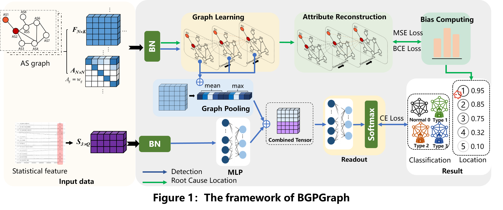

# BGPgraph

``pyg_test_418.py`` 训练GCN模型  
``python3 pyg_tesy_418.py ``  
``autoencoder.py`` 加载GCN的预训练模型，并且训练auto-encoder模型
``python3 autoencoder.py ``  
``Mydataset.py`` 加载所用GCN数据，包括节点属性、边属性和邻接矩阵
``test_autoencoder.py`` 测试auto-encoder模型使用
``test_GCN.py`` 测试GCN模型使用
